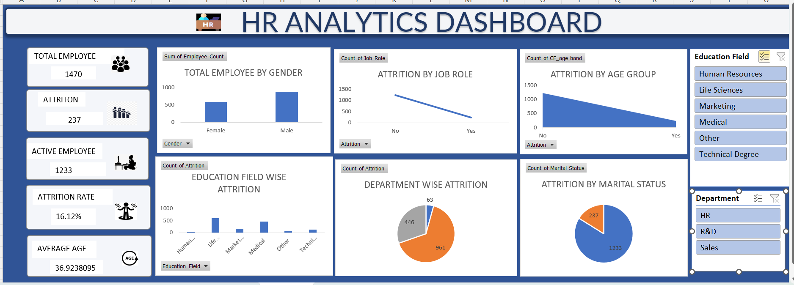

##  Sales Data Analysis Dashboard

 Project Overview

This project is a Sales Data Analysis Dashboard that provides insights into sales performance using SQL, Excel.
It helps visualize and analyze sales data across different dimensions such as city, category, payment mode, and order status

##  Objective

To analyze sales data efficiently and create a data-driven dashboard that helps understand:

Total and average sales performance

Best performing city and category

Customer payment preferences

Order status distribution (Delivered vs Cancelled)

##  Tools and Technologies Used

Tool	Purpose

SQL Server	Data extraction, transformation, and aggregation
MS Excel	Interactive Dashboard and visualization
Power Query / Pivot Table	Data cleaning and model creation in Excel

 Steps Involved

1. Data Preparation

Imported raw sales data into SQL Server.

Cleaned and filtered records to remove inconsistencies.

2. SQL Analysis

Used SQL queries to extract key insights.

3. Excel Dashboard

Created an interactive dashboard using Pivot Tables, Slicers, and Charts to display:

 Sales by City

 Payment Mode Preference

 Category-wise Sales

 Order Status Distribution

 Top Performing City and Total Sales

##  Key Insights

Delhi recorded the highest total sales.

Most preferred payment mode was UPI.

Electronics category had the maximum revenue.

Overall total sales = 295,200 units.

## Future Enhancements

Integrate Power BI for dynamic visualization.

Automate data refresh using Python scripts.

Add forecasting model for future sales prediction

